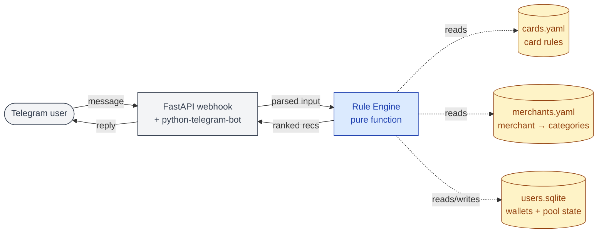

# CardKaki 🛫

> A Telegram bot that helps Singapore credit card holders earn the most air miles from every purchase — without needing to memorize each card's complicated bonus rules. Instead of manually cross-referencing merchant categories, monthly spending caps, and billing cycles across multiple cards, you just message it the store name and amount, and it instantly tells you which card to swipe and how many miles you'll earn. It turns what used to be a spreadsheet hobby into a two-second decision at checkout.

## The problem

Earning miles in Singapore is a research project disguised as a payment. To pick the optimal card for a single transaction, you need to mentally juggle:

- **Merchant Category Code (MCC)** — does this merchant qualify for the bonus?
- **Caps & sub-caps** — how much of HSBC Revo's S$1,500/month bonus pool have I used?
- **Minimum spend** — is UOB Visa Signature's S$1,000 threshold met yet?
- **Calendar vs statement month** — which clock is this card on?
- **Transaction date vs posting date** — will this transaction post in time?
- **Rounding rules** — UOB rounds down to nearest S$5, killing small transactions
- **FCY fees** — 3.25% can wipe out bonus rates
- **Card pooling** — UOB PPV/VS/Lady's share UNI$; which one to feed?

Existing tools have gaps:

| Tool | Limitation |
|------|------------|
| HeyMax Card Maximiser | Auto-tracking is Visa-only (Visa Offers Platform API dependency); Mastercard/Amex tracking is structurally impossible until those networks expose equivalents |
| Milelion | Authoritative knowledge buried in long-form articles |
| Bank apps | Track per-card on statement basis; no cross-card view |
| Mental math | You will forget the UOB rounding rule. Every time. |

## What this is

A **deterministic rule engine** wrapped in a **Telegram bot**. You message it `cold storage 45`, it tells you the optimal card from *your* wallet, with reasoning.

```
You: cold storage 45
Bot: 🥇 HSBC Revo:     4.0 mpd ✓ groceries
     🥈 UOB PPV:       3.1 mpd ⚠ in-store, not contactless?
     🥉 Citi Rewards:  0.4 mpd — base rate
     4️⃣ DBS Altitude:  0.4 mpd — base rate
     5️⃣ Amex KF:       0.3 mpd — base rate

You: klook 320
Bot: ⚠️  MCC 4722 (travel) — most 4mpd cards exclude this
     🥇 UOB PRVI: 1.4 mpd — base rate
     Use UOB PRVI or any general-spend card.
```

## Documentation

Engineering docs live in [`docs/`](docs/):

- **[architecture](docs/architecture.md)** — system overview, rule engine, period & posting-date models, data model, invariants.
- **[decisions](docs/decisions.md)** — numbered ADRs for the load-bearing design choices.
- **[operations](docs/operations.md)** — Railway deployment, backups, exit strategy.
- **[roadmap](docs/roadmap.md)** — v1–v4 history with ship gates and remaining work.

## Design principles

1. **Deterministic core, AI at the edges.** The rule engine is pure Python. LLMs only touch input parsing (v1.5) and the `/ask` knowledge layer (v3+). Miles math never runs through an LLM.
2. **Sub-second response.** If it's slower than glancing at your wallet, nobody uses it.
3. **Card rules as data, not code.** Every bank changes T&Cs constantly. Encode in YAML so updates are diffs, not refactors.
4. **Honest about uncertainty.** "Best-guess based on typical MCC. Verify against your statement." Set expectations, earn trust.
5. **Privacy by default.** No card numbers, no bank linkage, no PCI scope. Just merchant names and amounts.

## Architecture



**Reading the diagram:** the rule engine is the brain — it's a pure function with no I/O. The bot is a thin shell that handles Telegram plumbing and feeds structured input into the engine. The three data stores are deliberately separate concerns: card rules (rarely change), merchant mappings (community-growable), and user state (per-user, mutable).

→ Read [docs/architecture.md](docs/architecture.md) for the full design — module map, scoring algorithm, period & posting-date math, SQLite schema, and invariants.

## Tech stack

Boring on purpose.

- **Python 3.11+**
- **`python-telegram-bot`** — handles Telegram plumbing
- **FastAPI** — webhook receiver (lighter than long-polling for shared use)
- **Pydantic** — schema validation for `cards.yaml` (catch typos at startup)
- **SQLite** — the long-term answer for this project, not a stepping stone. Single-writer (the bot process), human-scale write rates, one server. SQLite handles this forever.
- **pytest** — the rule engine MUST be ruthlessly tested
- **Railway** — push-to-deploy, managed Postgres-style ergonomics for SQLite-on-volume, ~$5/month minimum. Trades cost for simplicity; the right call when you'd rather build features than wrangle infra.
- **Optional v1.5+:** Anthropic API (Claude Haiku) for parsing
- **Optional v4:** any vector DB (Chroma local is fine), Claude/GPT for `/ask`

## Things I will *not* build (and why)

- ❌ **Bank API integrations** — regulatory hell, SG banks largely don't expose them
- ❌ **PDF statement parsing in v1** — looks impressive, takes forever, manual log is fine
- ❌ **Optimal redemption calculator** — Milelion already does this well; reinventing is a trap
- ❌ **AI agent for the recommendation flow** — deterministic problem, deterministic solution
- ❌ **100% accuracy promises** — banks change rules, MCCs surprise, set expectations honestly
- ❌ **Public bot from day 1** — invite codes only until v2; spam will burn me out otherwise
- ❌ **All 40+ SG miles cards on day 1** — start with the 8 most-used, expand on demand

## Risks & mitigations

| Risk | Mitigation |
|------|------------|
| Bank changes T&Cs, my data goes stale | Daily monitoring of Milelion RSS, HeyMax announcements, and r/singaporefi. LLM proposes patches; human reviews before merging. |
| User loses miles trusting wrong rec | Disclaimer in `/start`, `⚠️` markers when uncertain, easy `/correct` flow |
| Merchant DB never gets accurate enough | `/correct` command lets users teach the bot; review submissions weekly |
| Telegram bot gets spammed | Invite-only via `/start <code>`; rate-limit per user |
| I lose interest | Code as if I will. Tests, README, deploy script. Future-me thanks present-me. |
| Milelion or HeyMax send angry email | Be a good citizen — attribution, no scraping behind logins, link out generously |

## Success metrics

For me, not for VCs:

- Do **I** use it weekly? (If not, kill the project.)
- Do 5 friends use it weekly after onboarding? (Real signal.)
- Does the merchant DB grow via `/correct` without my intervention? (Network effect working.)
- Number of "huh, didn't know that" reactions to a recommendation explanation. (Educational value.)

## Getting started

```bash
git clone <repo>
cd cardkaki
cp .env.example .env             # add TELEGRAM_BOT_TOKEN
uv sync                          # or pip install -e .
pytest                           # all green before you do anything else
python -m cardkaki.server        # local dev with ngrok
```

→ See [docs/operations.md](docs/operations.md) for Railway deployment, backups, and exit strategy.

## Inspirations & credits

- **The MileLion** (milelion.com) — the source of truth for SG miles knowledge. This bot stands on Aaron's shoulders.
- **HeyMax** — proved auto-tracking is valuable. Their Visa-only Card Maximiser is structurally locked to that network (Visa Offers Platform); manual logging is the only path to multi-network coverage, and that's the gap this project fills.
- **r/singaporefi** — community-maintained MCC observations.

## License

MIT. The card rules in `cards.yaml` are facts, not code; treat as public-domain reference.

---

*Built because picking a credit card shouldn't require a spreadsheet.*
