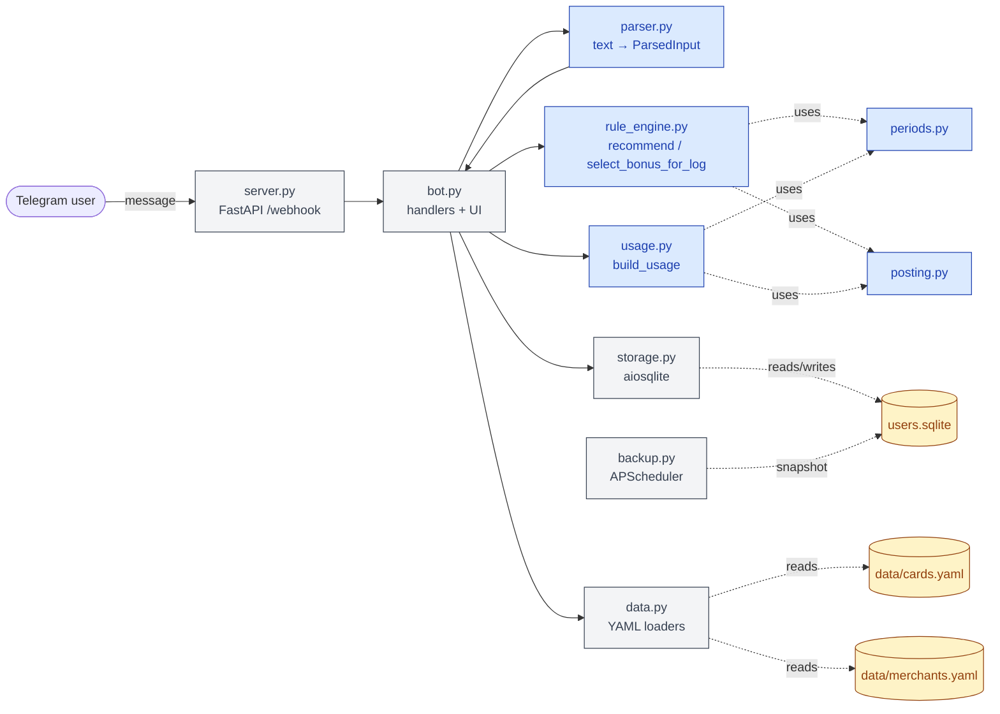
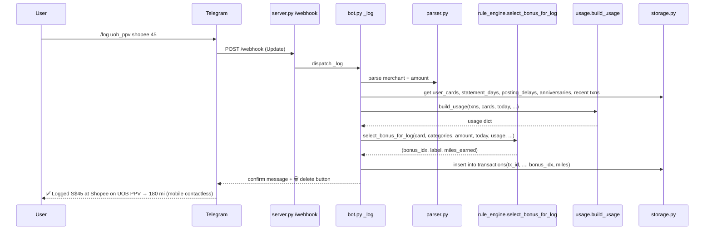

# Architecture

This document describes how CardKaki is built: what each module does, how the rule engine ranks cards, how period and posting-date math work, what the data layer looks like, and the invariants the system relies on. Audience: an engineer reading the repo cold. For *why* a particular choice was made, see [decisions.md](decisions.md).

## Contents

1. [System overview](#1-system-overview)
2. [Module map](#2-module-map)
3. [The rule engine](#3-the-rule-engine)
4. [Period model](#4-period-model)
5. [Posting date model](#5-posting-date-model)
6. [Pool & cap tracking](#6-pool--cap-tracking)
7. [Data model](#7-data-model)
8. [Bot interaction model](#8-bot-interaction-model)
9. [Storage layer](#9-storage-layer)
10. [Testing strategy](#10-testing-strategy)
11. [Invariants](#11-invariants)

## 1. System overview



The blue (pure) modules have no I/O. The bot layer assembles all inputs from storage + YAML, hands them to the engine, formats the result. This shape is the basis of the testing strategy ([§10](#10-testing-strategy)) and the [pure rule engine decision](decisions.md#9-pure-rule-engine-no-io-in-recommend).

## 2. Module map

| Path | Responsibility | Key surface |
|---|---|---|
| `cardkaki/server.py` | FastAPI app exposing `/webhook` for Telegram | `app`, `webhook()` |
| `cardkaki/bot.py` | Command + callback handlers, message formatting, inline keyboards | `_start`, `_cards`, `_log`, `_pools`, `_recent`, `_lady_choice`, `_text`, callback routers |
| `cardkaki/parser.py` | Free-text → `ParsedInput` (merchant, amount, fcy flag) | `parse(text)` |
| `cardkaki/rule_engine.py` | Pure scoring: rank cards by miles for one transaction | `recommend()`, `select_bonus_for_log()` |
| `cardkaki/usage.py` | Pure rollup: `TxnRow[]` → per-(card, bonus) period spend | `build_usage()` |
| `cardkaki/periods.py` | Period math: `[start, end)` bounds, days-left, labels | `period_bounds()`, `days_left()`, `period_label()` |
| `cardkaki/posting.py` | Posting-date prediction + period-boundary warnings | `resolve_posting_date()`, `posting_period_warning()` |
| `cardkaki/storage.py` | aiosqlite wrapper, schema, txn CRUD, per-user settings | `Storage` class |
| `cardkaki/data.py` | YAML loading + Pydantic validation for `cards.yaml` / `merchants.yaml` | `load_cards()`, `load_merchants()` |
| `cardkaki/models.py` | Pydantic + dataclass schemas | `Card`, `Bonus`, `Rounding`, `ParsedInput`, `Recommendation`, `TxnRow`, `BonusUsage` |
| `cardkaki/backup.py` | Daily SQLite snapshot via APScheduler | `backup_db()` |
| `tests/` | pytest unit + scenario coverage | see [§10](#10-testing-strategy) |
| `data/cards.yaml` | Card rules — the product's truth | — |
| `data/merchants.yaml` | Merchant → internal category mapping | — |

## 3. The rule engine

The rule engine is the brain. It's a pure function with no I/O — every input comes from the caller, and the output is deterministic given those inputs. See [Decision #9](decisions.md#9-pure-rule-engine-no-io-in-recommend) for why.

### 3.1 Public surface

```python
def recommend(
    user_cards: list[Card],
    merchant_categories: list[str],
    amount_sgd: float,
    is_fcy: bool = False,
    today: date | None = None,
    usage: dict[tuple[str, int], BonusUsage] | None = None,
    statement_days: dict[str, int] | None = None,
    posting_delays: dict[str, int] | None = None,
    same_day_merchant: bool = False,
    anniversary_months: dict[str, int] | None = None,
) -> list[Recommendation]: ...
```

Returns a ranked list — best card first. Ranking is `(-miles, card_name.lower())` so ties break alphabetically; the order is stable across calls.

### 3.2 v1 vs v2 evaluation paths

The engine has two evaluation paths, selected by whether `usage` is `None`:

- **v1 (`usage is None`)**: caps and min-spend appear in the reasons strings as informational only. No txn history is consulted; nothing is gated. Used by the stateless v1 bot path and as a fallback when usage isn't available.
- **v2 (`usage` provided)**: the engine *gates* min-spend and *blends* on cap overflow. A bonus that hasn't met its min-spend threshold doesn't fire. A txn that crosses the cap line splits across bonus and base rates ([§3.5](#35-cap-overflow-blend)).

Both paths share `_apply_rounding`, `_base_rate`, and `_bonus_qualifies` to keep behavior consistent.

### 3.3 Scoring algorithm (v2, simplified)

```
for each card in user_cards:
    amt_for_miles = apply_rounding(card, amount_sgd)
    base_rate = base_rate_for(card, is_fcy)
    base_miles = floor(amt_for_miles * base_rate)

    period_date = posting_date if card.tracks_by == "posting_date" else today

    candidates = []
    for idx, bonus in enumerate(card.bonus):
        if not bonus_qualifies(bonus, merchant_categories, is_fcy):
            continue
        u = usage[(card.id, idx)]

        # Gate: min-spend (current txn counts toward threshold)
        if bonus.min_spend_sgd is not None:
            if u.min_spend_sgd + amt_for_miles < bonus.min_spend_sgd:
                continue   # bonus can't fire on this txn

        # Gate + blend: cap
        bonus_amt, base_amt_in_blend = amt_for_miles, 0
        if bonus.cap_sgd is not None:
            remaining = max(0, bonus.cap_sgd - u.spend_sgd)
            if remaining <= 0:
                continue
            if remaining < amt_for_miles:
                bonus_amt = remaining
                base_amt_in_blend = amt_for_miles - remaining

        miles = floor(bonus_amt * bonus.rate_mpd) \
              + floor(base_amt_in_blend * base_rate)
        candidates.append((miles, bonus, blend_reason))

    # Pick highest miles, not highest rate (a fully-blended low-rate bonus
    # can beat a partially-blended higher-rate bonus on small txns).
    best_miles, best_bonus = max(candidates, key=lambda c: c.miles, default=(0, None))
    miles = best_miles if best_miles >= base_miles else base_miles

rank by (-miles, card_name.lower())
```

The "highest miles, not highest rate" choice is load-bearing: when two bonuses match on the same txn (e.g., generic 4 mpd online + a 4-mpd grocery bonus on a Cold Storage txn), the bonus with more *headroom* wins after blending, even if its nominal rate is identical. With different nominal rates, this is what stops a near-exhausted higher-rate bonus from beating a fresh lower-rate one.

### 3.4 Rounding

Rounding is per-card and applied **before** the rate is multiplied. Methods:

- `none` — no rounding.
- `floor_sgd_1` — floor to whole SGD. Used by HSBC Revolution.
- `floor_sgd_5` — floor to nearest S$5. Used by UOB cards. A S$9.99 swipe earns miles on S$5; a S$24 swipe earns miles on S$20. This is the largest source of "I expected more miles" surprise.

When rounding shaves the txn, the engine surfaces it: `"rounded S$9.99 → S$5"`.

### 3.5 Cap-overflow blend

When `u.spend_sgd + amount_sgd > cap_sgd`, miles split:

```
miles = floor(remaining * bonus.rate_mpd) + floor((amount - remaining) * base_rate)
```

The reason string explains: `"cap S$1500 • S$200 left → 4mpd on S$200, 0.4mpd on S$300"`. See [Decision #5](decisions.md#5-cap-overflow-blend-vs-hard-cutoff) for why this matches bank reality.

### 3.6 FCY handling

When `is_fcy=True`:

- The transaction is multiplied by `1 + card.fcy_fee` to compute *cost* (used in the `effective_mpd` denominator).
- Bonuses that don't have `applies_to_fcy: true` are skipped.
- Base rate may also be FCY-gated via `card.applies_base_to_fcy=False` (rare).
- An optional `card.base_rate_mpd_fcy` overrides the SGD base rate for FCY swipes.

`effective_mpd = miles / cost`, rounded to 2 d.p. Surfacing effective rather than nominal mpd is half the value of the project — a 4-mpd card that loses 3.25% to FCY is really doing about 3 mpd, and the user's wallet decisions should reflect that.

### 3.7 `select_bonus_for_log`

When the user logs a transaction, we don't just want to know "how many miles" — we want to know which `bonus_idx` qualified, so future usage rollups attribute the spend to the right bucket. `select_bonus_for_log` mirrors the v2 gating logic and returns `(bonus_idx, bonus_label, miles_earned)`.

This means **past txns stick to the bonus they qualified for** at log time, even if `cards.yaml` is later edited. A reorg of the bonus list doesn't retroactively rewrite history.

### 3.8 Failure modes

| What goes wrong | What the engine does |
|---|---|
| `amount_sgd <= 0` | Raises `ValueError`; bot surfaces a parse error to the user |
| Merchant not in `merchants.yaml` | Falls through with empty categories → only wildcard bonuses (empty `categories`) match → cards rank by base rate; bot adds `?` to merchant in output |
| All bonuses excluded (e.g. `travel_excluded`) | Engine surfaces `"⚠ excluded: travel"` and ranks by base rate |
| Cap fully consumed | Bonus skipped; reason `"⚠ <label> cap reached"`; falls to next-best bonus or base |
| Min-spend not yet met | Bonus skipped; reason `"⚠ S$80 from <label> min spend, 6 days left in calendar month"` |
| FCY swipe on a card with `applies_to_fcy: false` for all bonuses | Falls to base; FCY fee still surfaced in reasons |
| `posting_delays` provided but `card.tracks_by="transaction_date"` | `period_date = today`; no posting math runs (DBS, Maybank cards) |
| `anniversary_year` cap with no `anniversary_months[card.id]` | `period_bounds` raises; bot prompts the user to set their anniversary month |

## 4. Period model

`periods.py` owns date math. The engine and the usage rollup both delegate to it.

### 4.1 Period types

```python
PeriodLiteral = Literal[
    "calendar_month",
    "statement_month",
    "calendar_quarter",
    "statement_quarter",
    "anniversary_year",
]
```

All period bounds are returned as half-open `[start, end)` — `end` is exclusive. Inclusion test is uniformly `start <= d < end`.

### 4.2 `period_bounds`

```python
def period_bounds(
    period: PeriodLiteral,
    today: date,
    statement_day: int | None = None,
    anniversary_month: int | None = None,
) -> tuple[date, date]: ...
```

Behavior:

- **`calendar_month`**: `[YYYY-MM-01, YYYY-(M+1)-01)`.
- **`statement_month`**: cycle ending on `statement_day` (the *closing* day, 1..28). If `today.day <= statement_day`, today is in the cycle that ends `statement_day` *this* month. Otherwise it's in the cycle ending *next* month. Falls back to `calendar_month` when `statement_day is None`.
- **`calendar_quarter`**: `[Jan-1 / Apr-1 / Jul-1 / Oct-1, +3 months)`.
- **`statement_quarter`**: same cycle-day convention as statement_month, scaled to 3 months. (No card uses this today; future-proof.)
- **`anniversary_year`**: 12-month window starting on `anniversary_month/year` (year shifts back if today's month is before the anniversary month). Requires `anniversary_month`; raises otherwise.

### 4.3 Month-end clamping

`_safe_date(year, month, day)` clamps `day` to the last valid day of `month`. This handles February 29/30/31 transparently — a `statement_day` of 28 is always valid; if the user picks (say) 30, period bounds in February still work. `statement_day` is also CHECK-constrained at the schema level to `1..28` to avoid the ambiguity entirely.

### 4.4 `days_left`

```python
def days_left(period, today, statement_day=None, anniversary_month=None) -> int
```

Returns days remaining in the current cycle including today (1 = last day, 0 = already past — the latter shouldn't occur with half-open bounds). Used in min-spend reason strings (`"… 6 days left in calendar month"`) and `/pools` end-of-period nudges.

## 5. Posting date model

Several issuers post a transaction days after the swipe. If the txn is near a period boundary, that lag can move the spend into a different cap window than the calendar would suggest. CardKaki models this — the unique-vs-HeyMax layer.

### 5.1 `resolve_posting_date`

```python
def resolve_posting_date(
    txn_date: date,
    delay_days: int,
    same_day_merchant: bool = False,
) -> date:
    effective_delay = 0 if same_day_merchant else delay_days
    d = txn_date + timedelta(days=effective_delay)
    while d.isoweekday() > 5:    # 6=Sat, 7=Sun
        d += timedelta(days=1)
    return d
```

Two modifiers on top of T+N:

- **Weekend skip**: posting dates falling on Sat/Sun roll forward to Monday.
- **Same-day-posting merchants**: Grab, Shopee, NTUC, FairPrice etc. are tagged `same_day_posting: true` in `merchants.yaml`. For those merchants, `effective_delay = 0` regardless of issuer lag — they post the same calendar day they're swiped.

### 5.2 Approach B: threading posting date into the engine *and* the rollup

For cards with `tracks_by: posting_date`, period membership is computed against the **predicted posting date**, not the txn date — in **both** `recommend()` and `build_usage()`:

- `recommend()` uses `posting_date` as `period_date` to compute `days_left` for min-spend warnings, and to decide whether to emit a `posting_warning` on the recommendation.
- `build_usage()` uses each transaction's predicted posting date when deciding whether to count it toward the current cap window.

This is the load-bearing part. If only `recommend()` knew about posting dates and `build_usage()` summed by `txn_date`, the cap math would disagree with the warnings: a txn shown as "counts toward May cap" would still be summed into April's totals. Both paths must use the same date. See [Decision #3](decisions.md#3-approach-b-for-posting-date-threading).

For `tracks_by: transaction_date` cards (DBS, Maybank — they snapshot on swipe, not post), no posting math runs; `period_date = today`.

### 5.3 Worked example: 11 pm 30 Apr on HSBC Revo

- `txn_date = 2026-04-30 (Thursday)`, HSBC has `posting_delay_days = 1`, merchant is not same-day.
- `resolve_posting_date(2026-04-30, 1) = 2026-05-01 (Friday)`. No weekend skip needed.
- HSBC Revo's online-shopping bonus has `cap_period: calendar_month`. April's bounds are `[2026-04-01, 2026-05-01)`. Posting date `2026-05-01` is *not* in April's window — it's in May's `[2026-05-01, 2026-06-01)`.
- `recommend()`:
  - Computes the recommendation against May's cap state (using `usage` rolled up at May's bounds).
  - Emits `posting_warning = "Posts Fri 1 May — counts toward May cap, not Apr"`.
- `build_usage()` for the *next* recommendation will sum this txn into May's totals when the user logs it.

### 5.4 `posting_period_warning`

Returns a string only when `posting_date` falls outside `period_bounds(period, txn_date, ...)`. Same-period posting is silent — no warning needed.

## 6. Pool & cap tracking

### 6.1 `build_usage`

```python
def build_usage(
    txns: Iterable[TxnRow],
    user_cards: Iterable[Card],
    today: date,
    statement_days: dict[str, int] | None = None,
    posting_delays: dict[str, int] | None = None,
    anniversary_months: dict[str, int] | None = None,
) -> dict[tuple[str, int], BonusUsage]: ...
```

Pure rollup. For each `(card_id, bonus_idx)` in the user's wallet:

1. Figure out the bonus's `cap_period` and `min_spend_period` window bounds for `today`.
2. For each logged txn matching `(card_id, bonus_idx)`:
   - Compute its effective date — `posting_date` if the card tracks by posting date and `posting_delays` was provided, else `txn_date`.
   - If the effective date falls in `cap_period`, add to `spend_sgd`.
   - If the effective date falls in `min_spend_period`, add to `min_spend_sgd`.
3. Emit `BonusUsage(spend_sgd, min_spend_sgd)`.

Txns that pre-date a user's wallet additions are still summed if `bonus_idx` matches — meaningful only when the user re-adds a card.

### 6.2 Redemption pools

Cards declare `pool: <name>` in `cards.yaml`. `/pools` aggregates per-card rows by pool for display:

```
uob_unis (PPV / VS / Lady)
  ├─ PPV mobile contactless: S$520 / S$600 (calendar month)
  ├─ VS bonus: S$880 / S$1000 (statement month, 4 days left)
  └─ Lady chosen=transport: S$320 / S$1000 (calendar month)
```

Pool is presentation, not constraint — per-card cap math still applies. See [Decision #4](decisions.md#4-pool-keyed-cap-aggregation).

### 6.3 Lady's chosen category

UOB Lady's bonus rate applies to one category the user picks each statement month. Stored in `lady_choices` keyed by `(telegram_user_id, effective_from)` — the table holds *history*, not single state. The current choice is the row with the largest `effective_from <= today`. Past txns continue to credit against the choice in effect when they were swiped; logging hygiene is the user's responsibility.

## 7. Data model

### 7.1 `cards.yaml`

Each card is a `Card` object (Pydantic, `extra="forbid"` — typos fail at startup):

```yaml
- id: hsbc_revo                       # stable string id, used in URLs/SQL
  name: HSBC Revolution               # display name
  issuer: hsbc
  network: visa                       # visa | mastercard | amex
  base_rate_mpd: 0.4
  base_rate_mpd_fcy: null             # optional override for FCY swipes
  applies_base_to_fcy: true
  rounding: { method: floor_sgd_1 }   # none | floor_sgd_1 | floor_sgd_5
  bonus:
    - rate_mpd: 4.0
      label: online or contactless
      categories: [online_shopping, dining_local, contactless]
      excluded_categories: [fast_food_excluded, travel_excluded, …]
      applies_to_sgd: true
      applies_to_fcy: true
      cap_sgd: 1000
      cap_period: calendar_month      # one of PeriodLiteral
      min_spend_sgd: null
      min_spend_period: null
  pool: hsbc_rewards                  # redemption-pool key (groups for /pools)
  tracks_by: posting_date             # posting_date | transaction_date
  posting_delay_days: 1               # default; per-user override may shadow
  anniversary_year: false             # if true, bot prompts for anniversary month
  fcy_fee: 0.0325
  notes: "…"
```

Empty `categories` on a bonus is a wildcard — *any* merchant qualifies.

### 7.2 `merchants.yaml`

Two shapes for a value:

```yaml
# Shape A: category list only
cold_storage:    [groceries, contactless]

# Shape B: dict with same_day_posting flag
ntuc:
  categories: [groceries, contactless]
  same_day_posting: true
```

Categories mix positive labels (`groceries`, `online_shopping`) with bank-specific exclusion signals (`travel_excluded`, `petrol_uob_excluded`, `wallet_topup`). A bonus's `excluded_categories` is the negative-vetoes-positive mechanism: if any excluded category overlaps the merchant's categories, that bonus doesn't qualify, and the engine surfaces the exclusion reason.

### 7.3 SQLite schema

`storage.SCHEMA` (single source of truth — applied idempotently at startup):

```sql
CREATE TABLE IF NOT EXISTS users (
  telegram_user_id INTEGER PRIMARY KEY,
  created_at TEXT NOT NULL DEFAULT (datetime('now'))
);

CREATE TABLE IF NOT EXISTS user_cards (
  telegram_user_id INTEGER NOT NULL,
  card_id TEXT NOT NULL,
  added_at TEXT NOT NULL DEFAULT (datetime('now')),
  PRIMARY KEY (telegram_user_id, card_id),
  FOREIGN KEY (telegram_user_id) REFERENCES users(telegram_user_id) ON DELETE CASCADE
);

CREATE TABLE IF NOT EXISTS transactions (
  tx_id TEXT PRIMARY KEY,                    -- uuid4
  telegram_user_id INTEGER NOT NULL,
  card_id TEXT NOT NULL,
  bonus_idx INTEGER,                         -- nullable: txn fell to base
  bonus_label TEXT,                          -- snapshotted at log time
  merchant TEXT NOT NULL,
  amount_sgd REAL NOT NULL,
  is_fcy INTEGER NOT NULL DEFAULT 0,
  miles_earned INTEGER NOT NULL,
  txn_date TEXT NOT NULL,                    -- ISO date
  created_at TEXT NOT NULL DEFAULT (datetime('now')),
  FOREIGN KEY (telegram_user_id) REFERENCES users(telegram_user_id) ON DELETE CASCADE
);
CREATE INDEX IF NOT EXISTS idx_txns_user_date
  ON transactions (telegram_user_id, txn_date);
CREATE INDEX IF NOT EXISTS idx_txns_user_card_bonus_date
  ON transactions (telegram_user_id, card_id, bonus_idx, txn_date);

CREATE TABLE IF NOT EXISTS card_statement_days (
  telegram_user_id INTEGER NOT NULL,
  card_id TEXT NOT NULL,
  statement_day INTEGER NOT NULL CHECK (statement_day BETWEEN 1 AND 28),
  updated_at TEXT NOT NULL DEFAULT (datetime('now')),
  PRIMARY KEY (telegram_user_id, card_id),
  FOREIGN KEY (telegram_user_id) REFERENCES users(telegram_user_id) ON DELETE CASCADE
);

CREATE TABLE IF NOT EXISTS lady_choices (
  telegram_user_id INTEGER NOT NULL,
  category TEXT NOT NULL,
  effective_from TEXT NOT NULL,              -- ISO date
  PRIMARY KEY (telegram_user_id, effective_from),
  FOREIGN KEY (telegram_user_id) REFERENCES users(telegram_user_id) ON DELETE CASCADE
);

CREATE TABLE IF NOT EXISTS card_posting_delays (
  telegram_user_id INTEGER NOT NULL,
  card_id TEXT NOT NULL,
  delay_days INTEGER NOT NULL CHECK (delay_days BETWEEN 0 AND 7),
  updated_at TEXT NOT NULL DEFAULT (datetime('now')),
  PRIMARY KEY (telegram_user_id, card_id),
  FOREIGN KEY (telegram_user_id) REFERENCES users(telegram_user_id) ON DELETE CASCADE
);

CREATE TABLE IF NOT EXISTS card_anniversaries (
  telegram_user_id INTEGER NOT NULL,
  card_id TEXT NOT NULL,
  anniversary_month INTEGER NOT NULL CHECK (anniversary_month BETWEEN 1 AND 12),
  updated_at TEXT NOT NULL DEFAULT (datetime('now')),
  PRIMARY KEY (telegram_user_id, card_id),
  FOREIGN KEY (telegram_user_id) REFERENCES users(telegram_user_id) ON DELETE CASCADE
);
```

Notes:

- `PRAGMA foreign_keys = ON` is set on every connection.
- `card_id` is a string id from `cards.yaml`, not a foreign key — cards live outside SQLite.
- `bonus_idx` is the positional index into `card.bonus`. Past txns are pinned to the bonus they qualified for at log time ([§3.7](#37-select_bonus_for_log)); reordering `card.bonus` rewrites history.

### 7.4 Pydantic + dataclass models

```python
class Card(BaseModel):           # pydantic, extra="forbid"
class Bonus(BaseModel):
class Rounding(BaseModel):
class ParsedInput(BaseModel):    # parser output: merchant, amount_sgd, is_fcy
class Recommendation(BaseModel): # engine output: card_id, miles, mpd, reasons, posting_warning
class TxnRow(BaseModel):         # storage row
@dataclass(frozen=True)
class BonusUsage:                # spend_sgd, min_spend_sgd — usage rollup output
```

`extra="forbid"` is what catches `cap_sgd: 150o` (letter O instead of zero) before it silently de-types.

## 8. Bot interaction model

### 8.1 Command surface

| Command | What it does |
|---|---|
| `/start` | Onboarding, command summary, links to /cards catalog |
| `/cards` | List wallet; `/cards add <id>`, `/cards remove <id>`, `/cards list`, `/cards catalog` |
| `/log` | Two paths: `/log <card> <merchant> <amount> [fcy] [yyyy-mm-dd]` direct, or `/log <merchant> <amount>` to open the card-picker |
| `/pools` | Show all caps grouped by redemption pool, with days-left / posting-cliff nudges |
| `/recent` | Last N logged txns; per-row 🗑 button to delete |
| `/lady_choice` | Set/inspect UOB Lady's chosen category |
| free text | `merchant amount [fcy]` → recommendation; identical to `/log` without `/log` |

### 8.2 Inline keyboard patterns

- **📝 Log this** appears under recommendations — taps open the same `/log` flow with merchant/amount/card pre-filled.
- **🗑 Delete** appears next to each row in `/recent`.
- **↩ Undo** appears immediately after a delete confirmation, restoring the deleted row.
- **Statement-day prompt** fires on `/cards add` for cards using `statement_month` periods.
- **Anniversary-month prompt** fires on `/cards add` for cards declaring `anniversary_year: true`.
- **Log card-picker** for `/log <merchant> <amount>` when the user doesn't pre-name a card; shows one button per owned card.
- **Log date-picker** after card pick — today vs. custom ISO date.

Callback data is deliberately small (action + a few short fields). Long-lived state lives in SQLite, not callback payloads.

### 8.3 Sequence: `/log uob_ppv shopee 45`



The `build_usage` call uses *current* state to determine the bonus assignment. Once stored, the `bonus_idx` is frozen on that row.

### 8.4 Webhook layer (`server.py`)

FastAPI app exposing `POST /webhook`. Hands the raw update to the python-telegram-bot `Application` for routing; otherwise unopinionated. Health check at `GET /` for Railway. See [Decision #7](decisions.md#7-webhook-over-long-polling-on-railway) for why this isn't long-polling.

## 9. Storage layer

`storage.Storage` is an async SQLite wrapper using `aiosqlite`. Each public method opens a fresh connection (cheap, since SQLite connect is in-process). The bot is a single OS process, so there's exactly one writer. See [Decision #1](decisions.md#1-sqlite-as-the-durable-store).

Specifics:

- **No migrations framework.** `SCHEMA` is a single `CREATE … IF NOT EXISTS` script run on boot. Schema changes are additive (new tables, new columns with defaults). A real migration would be a one-off Python script bumping the schema.
- **`PRAGMA foreign_keys = ON`** is set after connect — `ON DELETE CASCADE` only fires when this is enabled. A user delete cascades to their cards, txns, and per-card settings.
- **`tx_id` is a uuid4 string**, generated bot-side. Idempotency-friendly if we ever need to re-deliver a webhook.
- **Backups via `backup.py`** run daily under APScheduler. Uses `sqlite3.Connection.backup()` for a consistent snapshot without locking the live DB; `cp` would risk a corrupted file mid-write. See [`docs/operations.md`](operations.md#backups--data-portability).

## 10. Testing strategy

The rule engine is the contract. If any other test suite is allowed to drift, this one isn't.

- **`tests/test_rule_engine.py`** — covers v1 + v2 paths, rounding (both methods), FCY (gating, fee math, base override), exclusions, multi-bonus selection, cap blends, min-spend gating, ranking ties, anniversary-year periods. The most-touched file in the repo.
- **`tests/test_periods.py`** — `period_bounds` for all 5 period types, statement-day boundary cases, `_safe_date` clamping (Feb 29/30/31), `days_left`, fallback to calendar when `statement_day is None`.
- **`tests/test_posting.py`** — `resolve_posting_date` (T+N, weekend skip, same-day merchant), `posting_period_warning` (same-period silent, cross-period warns, anniversary-year case).
- **`tests/test_usage.py`** — `build_usage` rollup; posting-date vs txn-date routing; bonus_idx pinning; multi-period scenarios.
- **`tests/test_storage.py`** — schema apply; CRUD on each table; cascades; per-user setting overrides.
- **`tests/test_bot_handlers.py`** — handler-level tests with fake Telegram update objects; covers callback routing, inline keyboard payloads, error paths.
- **`tests/test_parser.py`** — text → `ParsedInput` cases.
- **`tests/test_scenarios.py`** — end-to-end recommendation flows that string parser → engine → expected output.
- **`tests/test_data.py`** — YAML loader sanity (real `cards.yaml` and `merchants.yaml` parse without errors).
- **`tests/test_server.py`** — webhook contract.
- **`tests/test_backup.py`** — `backup_db()` produces a readable DB; doesn't lock the source.

Pure-function modules (engine, periods, posting, usage) get tested in isolation with hand-built inputs, not fixtures-from-storage. That's the payoff of [Decision #9](decisions.md#9-pure-rule-engine-no-io-in-recommend).

## 11. Invariants

Things that must always be true. Each is the kind of statement that would warrant a property test if we were writing them.

- **Stable ranking.** `recommend()` returns cards sorted by `(-miles, card_name.lower())`. Ties break alphabetically, deterministically.
- **Posting-date consistency.** For `tracks_by: posting_date` cards, period membership is computed against predicted `posting_date` in *both* `recommend()` and `build_usage()`. They never disagree.
- **Past txns are sticky.** `transactions.bonus_idx` is the index that qualified at log time. Reordering `card.bonus` in `cards.yaml` does not retroactively rewrite which bonus an old txn counted toward.
- **Cap-blend non-negativity.** `bonus_amt = min(remaining, amt_for_miles)`. `base_amt_in_blend = amt_for_miles - bonus_amt >= 0`. Miles can never go negative.
- **Effective mpd is over cost, not amount.** `effective_mpd = miles / (amount_sgd * (1 + fcy_fee))`, rounded to 2 d.p. When cost is 0 (shouldn't happen — `amount_sgd > 0` is enforced), `effective_mpd = 0`.
- **Rounding before rate.** `floor()` is applied to the post-rounding amount; the rate multiplies that. Never the other way.
- **Half-open period bounds.** `period_bounds()` returns `[start, end)` with `end` exclusive. Membership is `start <= d < end`. `days_left = (end - today).days`.
- **Statement-day is 1..28.** Enforced at the SQLite CHECK level. Eliminates Feb-29/30/31 ambiguity for statement-month cycles.
- **Same-day posting overrides issuer lag.** `same_day_merchant=True` ⇒ effective delay 0 regardless of `posting_delay_days`. Weekend skip still applies *after* the (zeroed) delay if the txn date itself was a weekend — but practically txns happen on the date they happen, so this case is benign.
- **Wildcard bonuses match anything.** A `Bonus` with empty `categories` qualifies for every merchant subject to exclusions and FCY gating.
- **`extra="forbid"` everywhere.** Every Pydantic model rejects unknown fields, so a typo in `cards.yaml` fails at startup.
